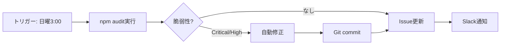
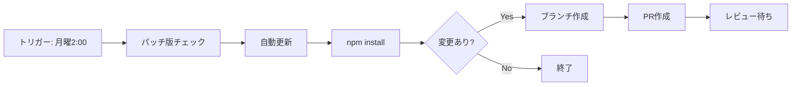
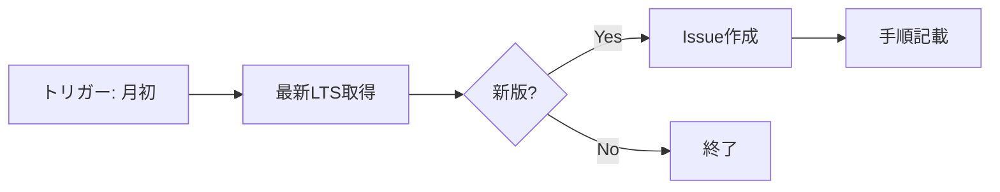
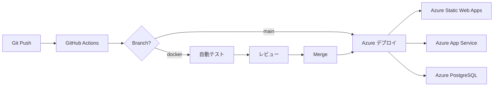

# プロジェクト設計書

## 📋 プロジェクト概要

**プロジェクト名**: Railway Maintenance System（鉄道保守管理システム）  
**リポジトリ**: Railway-web_sysytem  
**ブランチ**: docker  
**最終更新**: 2025年12月11日

### 目的
鉄道車両の運用管理、保守計画、検査記録を統合的に管理するWebアプリケーション

---

## 🏗️ システムアーキテクチャ

### 全体構成

```
┌─────────────────────────────────────────────────────────────┐
│                    Railway Maintenance System                │
└─────────────────────────────────────────────────────────────┘

┌──────────────────────┐         ┌──────────────────────┐
│   Client (Next.js)   │ ◄─────► │  Server (Express)    │
│   TypeScript + ESM   │  REST   │  JavaScript + ESM    │
│   Port: 3000         │   API   │  Port: 3001          │
└──────────────────────┘         └──────────────────────┘
                                           │
                                           ▼
                                  ┌─────────────────┐
                                  │   PostgreSQL    │
                                  │   Port: 5432    │
                                  └─────────────────┘
```

### 技術スタック

#### Frontend (Client)
- **Framework**: Next.js 15.2.4 (App Router)
- **Language**: TypeScript
- **UI Library**: React 19.x
- **Styling**: Tailwind CSS
- **Component Library**: Radix UI
- **Module System**: ESM

#### Backend (Server)
- **Framework**: Express.js 4.21.2
- **Language**: JavaScript (Pure ESM)
- **Module System**: ESM (`type: "module"`)
- **Database Driver**: pg 8.13.1
- **Environment**: dotenv 16.4.5

#### Database
- **RDBMS**: PostgreSQL 15+
- **ORM**: なし（生SQLクエリ）
- **接続プール**: pg.Pool

#### Runtime
- **Node.js**: 22.x以上（推奨: 22.x LTS）
- **npm**: 10.x以上
- **Package Manager**: npm

---

## 📁 プロジェクト構造

```
railway-maintenance-system/
├── .github/
│   ├── workflows/
│   │   ├── dependency-check.yml           # 週次セキュリティチェック
│   │   ├── auto-update-dependencies.yml   # 自動更新PR作成
│   │   └── node-version-check.yml         # Node.jsバージョン監視
│   ├── dependabot.yml                     # Dependabot設定
│   └── SECURITY_CONFIG.env                # セキュリティポリシー
│
├── client/                                # Frontend (Next.js)
│   ├── app/                               # Next.js App Router
│   │   ├── layout.tsx                     # ルートレイアウト
│   │   ├── page.tsx                       # ホームページ
│   │   ├── api/                           # API Routes（未使用推奨）
│   │   ├── failures/                      # 故障管理
│   │   ├── inspections/                   # 検査管理
│   │   ├── maintenance/                   # 保守管理
│   │   ├── management/                    # マスタ管理
│   │   ├── operations/                    # 運用管理
│   │   ├── settings/                      # 設定
│   │   ├── travel/                        # 走行管理
│   │   └── vehicles/                      # 車両管理
│   ├── components/                        # Reactコンポーネント
│   ├── lib/                               # ユーティリティ
│   ├── types/                             # TypeScript型定義
│   ├── public/                            # 静的ファイル
│   ├── .env.production                    # 本番環境変数（テンプレート）
│   ├── package.json
│   ├── next.config.mjs
│   ├── tailwind.config.ts
│   └── tsconfig.json
│
├── server/                                # Backend (Express)
│   ├── controllers/                       # ビジネスロジック
│   │   ├── basesController.js
│   │   ├── failuresController.js
│   │   ├── inspectionsController.js
│   │   ├── maintenanceCyclesController.js
│   │   ├── managementOfficesController.js
│   │   ├── operationsController.js
│   │   └── vehiclesController.js
│   ├── routes/                            # APIルート定義
│   │   ├── bases.js
│   │   ├── failures.js
│   │   ├── inspections.js
│   │   ├── maintenanceCycles.js
│   │   ├── managementOffices.js
│   │   ├── operations.js
│   │   └── vehicles.js
│   ├── server.js                          # エントリーポイント
│   ├── db.js                              # DB接続管理
│   ├── .env.production                    # 本番環境変数（テンプレート）
│   └── package.json
│
├── scripts/                               # データベーススクリプト
│   ├── setup-database.js                  # DB初期化
│   ├── migrate-database.js                # マイグレーション
│   ├── backup-database.js                 # バックアップ
│   ├── restore-database.js                # リストア
│   └── *.sql                              # SQLスクリプト
│
├── .env.development                       # ローカル開発用（テンプレート）
├── .env                                   # 実際の設定（Git除外）
├── renovate.json                          # Renovate Bot設定
├── package.json                           # Workspace設定
├── README.md                              # プロジェクト概要
├── DEPENDENCY_AUTOMATION.md               # 自動化ガイド
├── NODE_VERSION.md                        # Node.js互換性
└── PROJECT_ARCHITECTURE.md                # このファイル
```

---

## 🔧 設計方針

### 1. Docker不使用の決定

**理由**:
- シンプルさ優先
- オーバーヘッド削減
- ローカル開発の高速化
- 直接Node.jsで実行

**実装**:
- Node.js直接実行: `node --watch server.js`
- PostgreSQLはローカルまたはクラウドサービス
- 環境変数で環境切り替え

### 2. ESMモジュールへの統一

**Server（TypeScript → JavaScript ESM）**:
```javascript
// Before (TypeScript)
import express from 'express';
import type { Request, Response } from 'express';

// After (JavaScript ESM)
import express from 'express';
// 型チェックなし、シンプルに
```

**特徴**:
- すべての`import`に`.js`拡張子
- `package.json`に`"type": "module"`
- `__dirname`の代替: `fileURLToPath(import.meta.url)`
- CommonJSは完全排除

### 3. 環境変数の3層構造

```
┌─────────────────────────────────────────────────────────┐
│  開発環境 (Local Development)                            │
│  .env.development (テンプレート) → .env (実際の設定)      │
└─────────────────────────────────────────────────────────┘

┌─────────────────────────────────────────────────────────┐
│  本番環境 - Client (Production - Frontend)               │
│  client/.env.production (テンプレート)                   │
│  → クラウドプラットフォームの環境変数で上書き             │
└─────────────────────────────────────────────────────────┘

┌─────────────────────────────────────────────────────────┐
│  本番環境 - Server (Production - Backend)                │
│  server/.env.production (テンプレート)                   │
│  → クラウドプラットフォームの環境変数で上書き             │
└─────────────────────────────────────────────────────────┘
```

**ファイル管理**:
- **Git管理**: `.env.development`, `client/.env.production`, `server/.env.production`（テンプレート）
- **Git除外**: `.env`, `.env.local`, `.env.production.local`（実際の設定・秘密情報）

### 4. ローカルと本番の完全分離

**原則**:
- データベースは完全に別インスタンス
- ストレージは相互連携しない
- 環境変数で完全切り替え
- 本番データをローカルで触らない

**実装**:
```javascript
// server/db.js
const isProduction = process.env.NODE_ENV === 'production';
const dbConfig = isProduction 
  ? process.env.DATABASE_URL_PROD 
  : process.env.DATABASE_URL_DEV;
```

---

## 🤖 自動化システム設計

### アーキテクチャ

```
┌─────────────────────────────────────────────────────────┐
│              GitHub Actions (自動実行)                   │
└─────────────────────────────────────────────────────────┘
                         │
        ┌────────────────┼────────────────┐
        ▼                ▼                ▼
┌──────────────┐  ┌──────────────┐  ┌──────────────┐
│ 週次監視      │  │ 自動更新      │  │ Node.js監視  │
│ 日曜 3:00    │  │ 月曜 2:00    │  │ 月初 3:00   │
└──────────────┘  └──────────────┘  └──────────────┘
        │                │                │
        ▼                ▼                ▼
┌──────────────────────────────────────────────────────┐
│           GitHub Issues / Pull Requests              │
│           + Slack通知（オプション）                   │
└──────────────────────────────────────────────────────┘
```

### 自動化フロー

#### 1. セキュリティ監視（毎週日曜 3:00）



**ファイル**: `.github/workflows/dependency-check.yml`

**処理内容**:
1. 全パッケージのセキュリティ監査
2. Critical/High脆弱性を自動修正
3. 更新可能なパッケージをリスト化
4. GitHub Issueでレポート作成
5. Slack通知（重大な場合）

#### 2. 自動更新PR作成（毎週月曜 2:00）



**ファイル**: `.github/workflows/auto-update-dependencies.yml`

**処理内容**:
1. パッチバージョン（1.0.0→1.0.1）のみ更新
2. 新ブランチ作成
3. Pull Request自動作成
4. 管理者がレビュー・マージ

#### 3. Node.jsバージョン監視（毎月1日）



**ファイル**: `.github/workflows/node-version-check.yml`

**処理内容**:
1. Node.js公式APIから最新LTSを取得
2. 現在のバージョンと比較
3. 新版があれば更新手順付きIssue作成

### 外部ボット連携

#### Dependabot
- GitHub標準機能
- シンプルな自動PR作成
- セキュリティアップデート優先
- 設定ファイル: `.github/dependabot.yml`

#### Renovate Bot
- より高度な自動化
- グループ化と自動マージ
- カスタマイズ性が高い
- 設定ファイル: `renovate.json`

---

## 🗄️ データベース設計

### ER図の概要

```
管理事業所 (management_offices)
    ↓ 1:N
基地 (bases)
    ↓ 1:N
車両 (vehicles)
    ↓ 1:N
┌───────────┬───────────┬───────────┐
│           │           │           │
運用計画     検査計画     故障記録     保守サイクル
(operation) (inspection)(failures)  (maintenance)
```

### 主要テーブル

| テーブル名 | 役割 | 主要カラム |
|-----------|------|-----------|
| `management_offices` | 管理事業所 | office_code, office_name |
| `bases` | 基地 | base_code, base_name, office_id |
| `vehicles` | 車両マスタ | vehicle_number, type, base_id |
| `operation_plans` | 運用計画 | date, vehicle_id, route |
| `operation_records` | 運用実績 | plan_id, actual_data |
| `inspection_plans` | 検査計画 | vehicle_id, scheduled_date |
| `inspections` | 検査実績 | plan_id, inspection_date |
| `failures` | 故障記録 | vehicle_id, failure_date |
| `repairs` | 修理記録 | failure_id, repair_date |
| `maintenance_cycles` | 保守サイクル | cycle_name, interval_days |

**詳細**: `database_er_diagram.md` を参照

---

## 🚀 デプロイ戦略

### 環境構成

```
┌─────────────────────────────────────────────────────┐
│  開発環境 (Development)                              │
│  - ローカルPC上で実行                                │
│  - PostgreSQL: localhost:5432                       │
│  - Client: localhost:3000                           │
│  - Server: localhost:3001                           │
└─────────────────────────────────────────────────────┘

┌─────────────────────────────────────────────────────┐
│  本番環境 (Production)                               │
│  - Microsoft Azure                                  │
│  - PostgreSQL: Azure Database for PostgreSQL        │
│  - Client: Next.js App (SSR/SSG)                    │
│  - Server: Node.js App (Express API)                │
└─────────────────────────────────────────────────────┘
```

### Azure デプロイ構成

#### 推奨構成: Azure App Service + Azure Database
- **Client**: Azure Static Web Apps（Next.jsに最適化）
- **Server**: Azure App Service（Node.js 22対応）
- **Database**: Azure Database for PostgreSQL Flexible Server
- **Storage**: Azure Blob Storage（ファイルアップロード用）
- **CDN**: Azure Front Door（グローバル配信）

#### 代替構成: Azure Container Apps
- **Client & Server**: Azure Container Apps（コンテナベース）
- **Database**: Azure Database for PostgreSQL
- **利点**: より柔軟なスケーリング、マイクロサービス対応

### Azure デプロイフロー



### Azure リソース構成

| リソース | サービス名 | 用途 |
|---------|----------|------|
| Frontend | Azure Static Web Apps | Next.jsアプリケーション |
| Backend | Azure App Service | Express APIサーバー |
| Database | Azure Database for PostgreSQL | データ永続化 |
| Storage | Azure Blob Storage | ファイルアップロード |
| CDN | Azure Front Door | グローバル配信・高速化 |
| Monitor | Azure Monitor / Application Insights | パフォーマンス監視 |
| Security | Azure Key Vault | 環境変数・秘密情報管理 |

---

## 📊 監視とメンテナンス

### 自動監視項目

| 項目 | 頻度 | アクション |
|------|------|-----------|
| セキュリティ脆弱性 | 毎週 | 自動修正 + Issue |
| パッケージ更新 | 毎週 | PR自動作成 |
| Node.jsバージョン | 毎月 | Issue作成 |
| Dependabot | リアルタイム | PR作成 |
| Renovate Bot | 設定可能 | PR作成 + 自動マージ |

### 管理者の定期作業

| 作業 | 頻度 | 所要時間 |
|------|------|---------|
| 自動PRのレビュー・マージ | 週1回（月曜） | 2分 |
| セキュリティアラート確認 | 発生時 | 1分（自動修正済み） |
| Node.js更新 | 月1回 | 10分 |
| データベースバックアップ確認 | 週1回 | 1分 |

**合計**: 週3分 + 月10分 = **月約22分**

---

## 🔐 セキュリティポリシー

### 脆弱性対応

| Severity | 対応期限 | 処理方法 |
|----------|---------|---------|
| Critical | 24時間以内 | 自動修正 + 即座通知 |
| High | 1週間以内 | 自動修正 + 週次レポート |
| Moderate | 1ヶ月以内 | 手動確認 + 週次レポート |
| Low | 3ヶ月以内 | 週次レポート |

### 自動修正の範囲

**✅ 自動修正される**:
- Critical/High脆弱性
- パッチバージョン更新（1.0.0→1.0.1）
- セキュリティパッチ

**⚠️ 手動確認が必要**:
- マイナーバージョン（1.0.0→1.1.0）
- メジャーバージョン（1.0.0→2.0.0）
- フレームワークのコア更新

---

## 🧪 テスト戦略（将来実装）

### 推奨テストフレームワーク

```json
{
  "devDependencies": {
    "vitest": "^1.0.0",           // ユニットテスト
    "playwright": "^1.40.0",      // E2Eテスト
    "@testing-library/react": "^14.0.0"  // React テスト
  }
}
```

### テスト構成（案）

```
tests/
├── unit/              # ユニットテスト
│   ├── client/
│   └── server/
├── integration/       # 統合テスト
│   └── api/
└── e2e/              # E2Eテスト
    └── scenarios/
```

---

## 📈 パフォーマンス目標

### クライアント
- **初回読み込み**: < 3秒
- **ページ遷移**: < 500ms
- **Lighthouse Score**: > 90点

### サーバー
- **API応答時間**: < 200ms (平均)
- **同時接続**: 100+
- **稼働率**: 99.9%

### データベース
- **クエリ実行時間**: < 100ms (平均)
- **接続プール**: 10-20接続
- **バックアップ**: 日次自動

---

## 🔄 開発ワークフロー

### Gitブランチ戦略

```
main (本番環境)
  ↑
  merge ← Pull Request ← レビュー
  ↑
docker (開発ブランチ)
  ↑
  feature/* (機能開発)
  bugfix/* (バグ修正)
  hotfix/* (緊急修正)
```

### コミットメッセージ規約

```
<type>: <subject>

<body>

<footer>
```

**Type**:
- `feat`: 新機能
- `fix`: バグ修正
- `docs`: ドキュメント
- `style`: コードスタイル
- `refactor`: リファクタリング
- `test`: テスト
- `chore`: その他

**例**:
```
feat: 車両検索機能を追加

- 車両番号での検索
- 基地での絞り込み
- ページネーション対応

Closes #123
```

---

## 📚 関連ドキュメント

| ドキュメント | 内容 |
|------------|------|
| `README.md` | プロジェクト概要・セットアップ |
| `DEPENDENCY_AUTOMATION.md` | 自動化システムの詳細 |
| `NODE_VERSION.md` | Node.js互換性情報 |
| `DATABASE_SETUP.md` | データベースセットアップ |
| `database_er_diagram.md` | ERダイアグラム詳細 |
| `DEPLOYMENT.md` | デプロイ手順 |
| `PROJECT_ARCHITECTURE.md` | このファイル |

---

## 🎯 今後の拡張計画

### Phase 1: 基本機能の安定化（現在）
- ✅ ESM移行完了
- ✅ 環境変数整理
- ✅ 自動化システム構築
- 🔄 Node.js 22へのアップグレード

### Phase 2: テストの導入
- ユニットテストの追加
- E2Eテストの実装
- CI/CDパイプラインの強化

### Phase 3: 本番デプロイ
- クラウドプラットフォーム選定
- デプロイ自動化
- モニタリング設定

### Phase 4: 機能拡張
- モバイル対応
- リアルタイム通知
- レポート機能強化
- AIによる予測保守

---

## 👥 開発チーム

**役割**:
- プロジェクトオーナー: Satoshi Niina
- リポジトリ: github.com/Satoshi-Niina/Railway-web_sysytem
- ブランチ: docker

---

## 📞 サポート

**問い合わせ**:
- GitHub Issues: プロジェクトのIssueで質問・バグ報告
- ドキュメント: 各種.mdファイルを参照
- 自動化: DEPENDENCY_AUTOMATION.md 参照

---

**最終更新**: 2025年12月11日  
**バージョン**: 1.0.0
