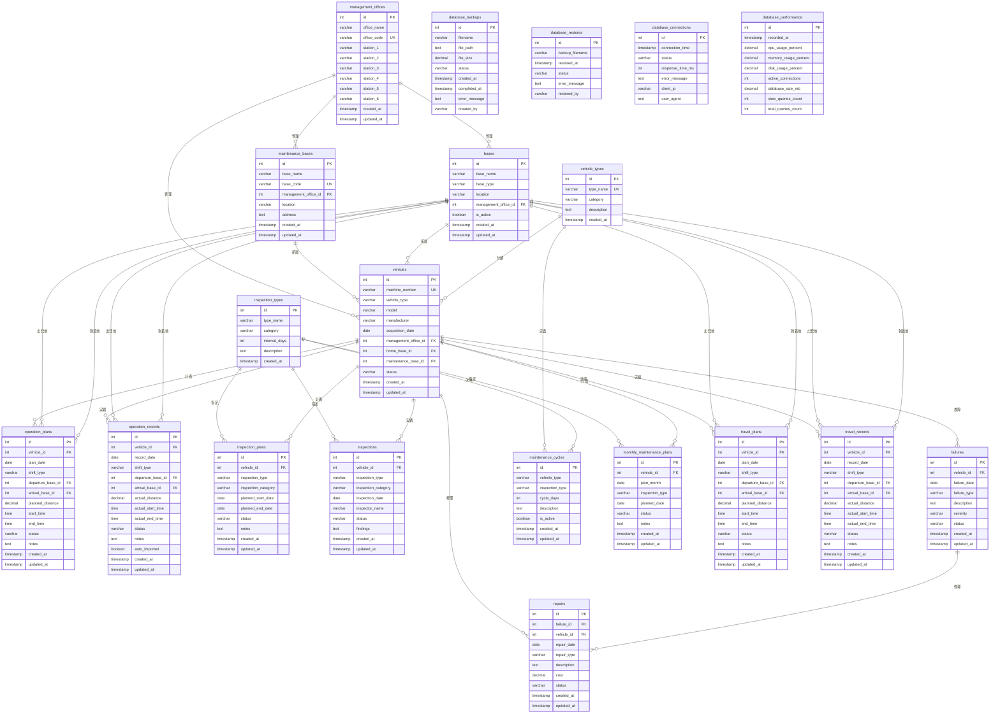

# 鉄道保守システム データベース ER図

## 概要
このシステムは鉄道車両の保守管理、運用計画、検査管理、故障管理を統合的に行うシステムです。

## ER図

## 主要テーブル説明

### 1. 管理事業所 (management_offices)
- 鉄道事業所の管理情報
- 担当駅の管理（station_1〜station_6）

### 2. 保守基地 (maintenance_bases)
- 車両の保守を行う基地の情報
- 管理事業所に所属

### 3. 車両 (vehicles)
- 鉄道車両の基本情報
- 管理事業所と保守基地に所属
- 車種による分類

### 4. 運用管理
- **運用計画 (operation_plans)**: 車両の運用予定
- **運用実績 (operation_records)**: 実際の運用記録
- **走行計画 (travel_plans)**: 走行予定
- **走行実績 (travel_records)**: 実際の走行記録

### 5. 保守管理
- **検査計画 (inspection_plans)**: 検査予定
- **検査実績 (inspections)**: 実際の検査記録
- **保守サイクル (maintenance_cycles)**: 車種別の検査周期
- **月次保守計画 (monthly_maintenance_plans)**: 月別の保守計画

### 6. 故障管理
- **故障記録 (failures)**: 車両の故障情報
- **修理記録 (repairs)**: 故障に対する修理記録

### 7. マスタデータ
- **車種 (vehicle_types)**: 車両の種類
- **検査種別 (inspection_types)**: 検査の種類

### 8. データベース管理
- **バックアップ履歴 (database_backups)**: データベースバックアップ記録
- **復元履歴 (database_restores)**: データベース復元記録
- **接続ログ (database_connections)**: データベース接続記録
- **パフォーマンスログ (database_performance)**: システムパフォーマンス記録

## 主要なビジネスルール

1. **車両管理**: 各車両は管理事業所と保守基地に所属
2. **運用管理**: 計画と実績の対比で運用効率を管理
3. **保守管理**: 車種別の保守サイクルに基づく定期検査
4. **故障管理**: 故障から修理までの一連の流れを記録
5. **データ管理**: システムの健全性を監視・記録 