# 鉄道保守システム データベース ER図

## 概要
このシステムは鉄道車両の保守管理、運用計画、検査管理、故障管理を統合的に行うシステムです。

## データベース構成

### スキーマ構造
```
webappdb/
├── master_data/      # マスタデータ（設定画面で管理）
├── operations/       # 運用管理データ
├── inspections/      # 検査管理データ
└── maintenance/      # 保守管理データ
```

## ER図

```mermaid
erDiagram
    %% ========================================
    %% master_data スキーマ
    %% ========================================
    
    %% 管理事業所
    management_offices {
        int id PK
        varchar office_name
        varchar office_code UK
        text responsible_area
        timestamp created_at
        timestamp updated_at
    }

    %% 基地
    bases {
        int id PK
        varchar base_name
        varchar base_type
        varchar location
        int management_office_id FK
        boolean is_active
        timestamp created_at
        timestamp updated_at
    }

    %% 車種
    vehicle_types {
        int id PK
        varchar type_name UK
        varchar category
        text description
        timestamp created_at
    }

    %% 車両
    vehicles {
        int id PK
        varchar machine_number UK
        varchar vehicle_type
        varchar model
        varchar manufacturer
        date acquisition_date
        int management_office_id FK
        int home_base_id FK
        varchar status
        timestamp created_at
        timestamp updated_at
    }

    %% 検査種別
    inspection_types {
        int id PK
        varchar type_name
        varchar category
        int interval_days
        text description
        timestamp created_at
    }

    %% 運用計画
    operation_plans {
        int id PK
        int vehicle_id FK
        date plan_date
        varchar shift_type
        int departure_base_id FK
        int arrival_base_id FK
        decimal planned_distance
        time start_time
        time end_time
        varchar status
        text notes
        timestamp created_at
        timestamp updated_at
    }

    %% 運用実績
    operation_records {
        int id PK
        int vehicle_id FK
        date record_date
        varchar shift_type
        int departure_base_id FK
        int arrival_base_id FK
        decimal actual_distance
        time actual_start_time
        time actual_end_time
        varchar status
        text notes
        boolean auto_imported
        timestamp created_at
        timestamp updated_at
    }

    %% 検査計画
    inspection_plans {
        int id PK
        int vehicle_id FK
        varchar inspection_type
        varchar inspection_category
        date planned_start_date
        date planned_end_date
        varchar status
        text notes
        timestamp created_at
        timestamp updated_at
    }

    %% 検査実績
    inspections {
        int id PK
        int vehicle_id FK
        varchar inspection_type
        varchar inspection_category
        date inspection_date
        varchar inspector_name
        varchar status
        text findings
        timestamp created_at
        timestamp updated_at
    }

    %% 故障記録
    failures {
        int id PK
        int vehicle_id FK
        date failure_date
        varchar failure_type
        text description
        varchar severity
        varchar status
        timestamp created_at
        timestamp updated_at
    }

    %% 修理記録
    repairs {
        int id PK
        int failure_id FK
        int vehicle_id FK
        date repair_date
        varchar repair_type
        text description
        decimal cost
        varchar status
        timestamp created_at
        timestamp updated_at
    }

    %% 保守サイクル
    maintenance_cycles {
        int id PK
        varchar vehicle_type
        varchar inspection_type
        int cycle_days
        text description
        boolean is_active
        timestamp created_at
        timestamp updated_at
    }

    %% 月次保守計画
    monthly_maintenance_plans {
        int id PK
        int vehicle_id FK
        date plan_month
        varchar inspection_type
        date planned_date
        varchar status
        text notes
        timestamp created_at
        timestamp updated_at
    }

    %% 走行計画
    travel_plans {
        int id PK
        int vehicle_id FK
        date plan_date
        varchar shift_type
        int departure_base_id FK
        int arrival_base_id FK
        decimal planned_distance
        time start_time
        time end_time
        varchar status
        text notes
        timestamp created_at
        timestamp updated_at
    }

    %% 走行実績
    travel_records {
        int id PK
        int vehicle_id FK
        date record_date
        varchar shift_type
        int departure_base_id FK
        int arrival_base_id FK
        decimal actual_distance
        time actual_start_time
        time actual_end_time
        varchar status
        text notes
        timestamp created_at
        timestamp updated_at
    }

    %% データベース管理テーブル
    database_backups {
        int id PK
        varchar filename
        text file_path
        decimal file_size
        varchar status
        timestamp created_at
        timestamp completed_at
        text error_message
        varchar created_by
    }

    database_restores {
        int id PK
        varchar backup_filename
        timestamp restored_at
        varchar status
        text error_message
        varchar restored_by
    }

    database_connections {
        int id PK
        timestamp connection_time
        varchar status
        int response_time_ms
        text error_message
        varchar client_ip
        text user_agent
    }

    database_performance {
        int id PK
        timestamp recorded_at
        decimal cpu_usage_percent
        decimal memory_usage_percent
        decimal disk_usage_percent
        int active_connections
        decimal database_size_mb
        int slow_queries_count
        int total_queries_count
    }

    %% ========================================
    %% リレーションシップ
    %% ========================================
    
    %% master_data 内部の関連
    management_offices ||--o{ bases : "管理"
    management_offices ||--o{ vehicles : "管理"
    bases ||--o{ vehicles : "所属基地"
    
    %% operations への参照
    vehicles ||--o{ operation_plans : "運用計画"
    vehicles ||--o{ operation_records : "運用実績"
    vehicles ||--o{ travel_plans : "走行計画"
    vehicles ||--o{ travel_records : "走行実績"
    
    bases ||--o{ operation_plans : "出発地"
    bases ||--o{ operation_plans : "到着地"
    bases ||--o{ operation_records : "出発地"
    bases ||--o{ operation_records : "到着地"
    bases ||--o{ travel_plans : "出発地"
    bases ||--o{ travel_plans : "到着地"
    bases ||--o{ travel_records : "出発地"
    bases ||--o{ travel_records : "到着地"
    
    %% inspections への参照
    vehicles ||--o{ inspection_plans : "検査計画"
    vehicles ||--o{ inspections : "検査実績"
    
    %% maintenance への参照
    vehicles ||--o{ failures : "故障記録"
    vehicles ||--o{ repairs : "修理記録"
    vehicles ||--o{ monthly_maintenance_plans : "月次保守計画"
    failures ||--o{ repairs : "修理"
```



## スキーマ別テーブル詳細

### master_data スキーマ（マスタデータ）

| テーブル名 | 説明 | 主要カラム |
|----------|------|----------|
| **management_offices** | 管理事業所 | office_name, office_code, responsible_area |
| **bases** | 基地 | base_name, base_type, location, management_office_id |
| **vehicles** | 車両 | machine_number, vehicle_type, model, management_office_id, home_base_id |
| **vehicle_types** | 車種マスタ | type_name, category, description |
| **inspection_types** | 検査種別マスタ | type_name, category, interval_days |

### operations スキーマ（運用管理）

| テーブル名 | 説明 | 主要カラム |
|----------|------|----------|
| **operation_plans** | 運用計画 | vehicle_id, plan_date, departure_base_id, arrival_base_id |
| **operation_records** | 運用実績 | vehicle_id, record_date, actual_distance, auto_imported |
| **travel_plans** | 走行計画 | vehicle_id, plan_date, planned_distance |
| **travel_records** | 走行実績 | vehicle_id, record_date, actual_distance |

### inspections スキーマ（検査管理）

| テーブル名 | 説明 | 主要カラム |
|----------|------|----------|
| **inspection_plans** | 検査計画 | vehicle_id, inspection_type, planned_start_date, planned_end_date |
| **inspections** | 検査実績 | vehicle_id, inspection_date, inspector_name, findings |
| **maintenance_cycles** | 保守サイクル | vehicle_type, inspection_type, cycle_days |

### maintenance スキーマ（保守管理）

| テーブル名 | 説明 | 主要カラム |
|----------|------|----------|
| **failures** | 故障記録 | vehicle_id, failure_date, failure_type, severity |
| **repairs** | 修理記録 | failure_id, vehicle_id, repair_date, cost |
| **monthly_maintenance_plans** | 月次保守計画 | vehicle_id, plan_month, inspection_type |

## テーブル間のリレーション

### 1. マスタデータの階層構造
```
管理事業所 (management_offices)
    ↓ (1:N)
基地 (bases)
    ↓ (1:N)
車両 (vehicles)
```

### 2. 運用データへの参照
```
車両 (vehicles) ─→ 運用計画 (operation_plans)
              ─→ 運用実績 (operation_records)
              ─→ 走行計画 (travel_plans)
              ─→ 走行実績 (travel_records)

基地 (bases) ─→ 出発地・到着地として各運用テーブルで参照
```

### 3. 検査データへの参照
```
車両 (vehicles) ─→ 検査計画 (inspection_plans)
              ─→ 検査実績 (inspections)
              ─→ 月次保守計画 (monthly_maintenance_plans)
```

### 4. 故障・修理データへの参照
```
車両 (vehicles) ─→ 故障記録 (failures) ─→ 修理記録 (repairs)
```

## 主要なビジネスルール

### データ管理の原則
1. **マスタデータ（master_data）**: 設定画面で管理、変更頻度が低い基本情報
2. **運用データ（operations）**: 日々の運用・走行の計画と実績
3. **検査データ（inspections）**: 定期検査の計画と実績
4. **保守データ（maintenance）**: 故障・修理の記録と保守計画

### データフロー
1. **設定**: 管理事業所 → 基地 → 車両の順に登録
2. **運用**: 車両と基地を指定して運用計画を作成 → 実績を記録
3. **検査**: 車両ごとに検査計画を作成 → 検査実施 → 実績を記録
4. **保守**: 故障発生 → 故障記録作成 → 修理実施 → 修理記録作成

### 外部システム連携（将来対応）
- 車両マスタ（machine_number, vehicle_type）は外部システムと連携可能
- 詳細は [EXTERNAL_SYSTEM_INTEGRATION.md](EXTERNAL_SYSTEM_INTEGRATION.md) を参照

## データ整合性の保証

### 外部キー制約
- すべての参照関係は外部キー制約で保証
- 削除時は参照元データの確認が必要

### カスケード設定
- 現在は手動削除を推奨（データ保護のため）
- 将来的にアーカイブ機能の実装を検討

### ステータス管理
- **vehicles.status**: active, inactive, retired
- **operation_plans.status**: planned, in_progress, completed, cancelled
- **failures.status**: reported, investigating, repairing, completed 